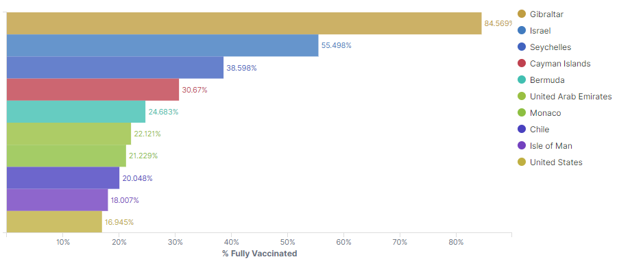
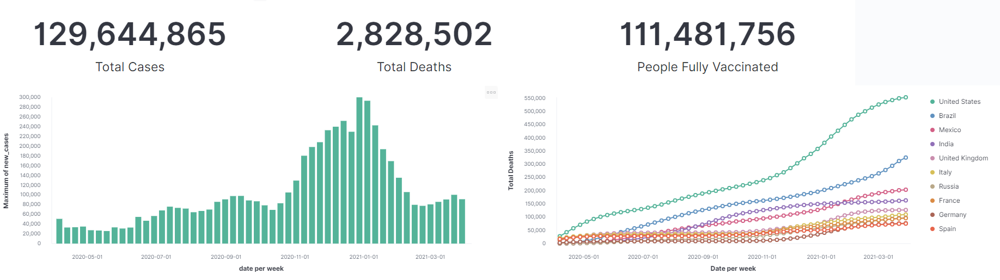
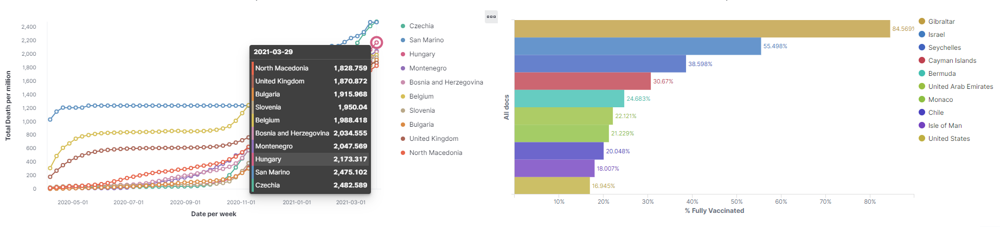
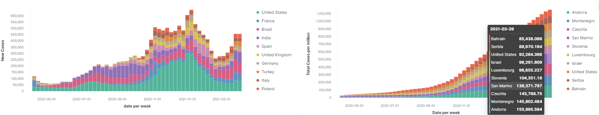

# Covid-19 Tracker Dashboard




## Motivation
Covid-19 was(is) an unprecedented pandemic that [stole the jobs of 114 million people] in 2020 and the [lives of another 2.8 million] as of 1st April 2021.


Relying on data gathered by Our World In Data ([OWID]), this project hopes to extract and visualize the global status of covid-19 in order to better understand its progression.
The [OWID Database] is updated everyday at roughly 08:30 UTC.

From the visualization above, we can see that Gibraltar and Israel leads the world in fully vaccinated residents, at 84.6% and 55.5% of their population respectively.
 </br>

Other visualizations track the no. of cases and deaths in each country due to Covid-19, as well as the no. of people fully vaccinated.

----

## Installation
### Environment
For the rest of this set-up, we will assume a ```Ubuntu 16 (Xenial Xerus)``` environment. There are different approaches to obtain an environment; you may follow this guide to [launch an EC2 instance running Ubuntu distribution on AWS]. I'll be using Vagrant + VirtualBox.

### Set-up Vagrant box with included Vagrantfile
Assuming you are on Windows OS, [install Vagrant](https://www.vagrantup.com/downloads) and [Oracle VirtualBox](https://www.virtualbox.org/wiki/Downloads). Once installed, copy Vagrantfile to your desired directory and run the following commands on Git Bash. This will set up your vagrant box and ssh into your new environment:
```bash
cd /path/to/Vagrantfile
vagrant up
vagrant ssh
```
### Apt install repositories
Using Ubuntu's native apt package manager in your Ubuntu box, update local package index files (**/etc/apt/sources.list** & **/etc/apt/sources.list.d**), then run the actual software upgrade.
```bash
sudo apt update && sudo apt upgrade -y
```
### Install Git & Python3
```bash
sudo apt install git 
```

ubuntu-xenial comes pre-installed with python 3.5. We require >= python 3.7 to run our script
Follow [this](https://pip.pypa.io/en/stable/installing/#using-linux-package-managers) guide to upgrade python 3.5 to python 3.7. Or in a nutshell:
```bash
sudo apt install software-properties-common
sudo add-apt-repository ppa:deadsnakes/ppa
sudo apt update
sudo apt install python3.7
sudo ln -sf /usr/bin/python3.7 /usr/bin/python3
cd ~
curl https://bootstrap.pypa.io/get-pip.py -o get-pip.py
python3 get-pip.py
```

### Elasticsearch & Kibana set-up
Elasticsearch is built using Java, and requires at least Java 8 in order to run. Only Oracle's Java and OpenJDK are supported. Additionally, the same JVM version should be used for all Elasticsearch nodes and clients. 

To install OpenJDK Java 8 and verify its installation, run the following commands:
``` bash
sudo apt install openjdk-8-jdk openjdk-8-jre
java -version
```
Finally, setup JAVA_HOME and JRE_HOME environment variables which are used by many Java applications to find Java libraries during runtime
```bash
cat >> /etc/environment <<EOL
JAVA_HOME=/usr/lib/jvm/java-8-openjdk-amd64
JRE_HOME=/usr/lib/jvm/java-8-openjdk-amd64/jre
EOL
```
- Referenced from [TechAdmin Java Installation Guide] 

<br>

To install **Elasticsearch**, run the following commands:
1. Import Elasticsearch public GPG key into APT
2. Add Elastic source list to the ```sources.list.d``` directory where APT will look for new sources
3. Update package lists so APT can read the new Elastic source
4. Install Elasticsearch
5. Start Elasticsearch service using systemctl manager
6. Enable Elasticsearch every time server boots
```bash
wget -qO - https://artifacts.elastic.co/GPG-KEY-elasticsearch | sudo apt-key add -
echo "deb https://artifacts.elastic.co/packages/7.x/apt stable main" | sudo tee -a /etc/apt/sources.list.d/elastic-7.x.list
sudo apt update
sudo apt install elasticsearch
sudo systemctl start elasticsearch
sudo systemctl enable elasticsearch
```

To install **Kibana**, run the following commands:
1. Because you've already added Elastic package source in the previous step, you can just install remaining components of Elastic Stack
2. Start Kibana service using systemctl manager
3. Enable Kibana every time server boots
```bash
sudo apt install kibana
sudo systemctl start kibana
sudo systemctl enable kibana
```
- Referenced from [DigitalOcean Elasticsearch & Kibana Installation Guide]

<br>

----

## Data Generation
### Git clone this repository to the home directory of your user directory
```bash
cd ~
git clone https://github.com/hideyukikanazawa/covid19-dashboard.git
```
### Using a Python venv
Install the python virtual environment package and create a new virtual environment **dashboard-venv**. Then pip install required python modules from requirements.txt into your **dashboard-venv** venv:
```bash
python3 -m pip install virtualenv --user
sudo apt-get install python3.7-venv
python3 -m venv ~/dashboard-venv

~/dashboard-venv/bin/pip3 install -r requirements.txt
```


### Load your dashboard data
```bash
/home/$USER/dashboard-venv/bin/python3 /home/$USER/covid-data-cronjob.py > /home/$USER/covid-data-cronjob.log 2>&1
```
> It might take ~ a minute or two for the execution to complete

### Enable cronjob

Edit your user's crontab file ( stored in **/var/spool/cron/crontabs** directory on Ubuntu ):
```bash
crontab -e
```

Append the following lines to the end of your crontab:
>CRON_TZ=UTC<br>
>30 08 * * * /home/$USER/dashboard-venv/bin/python3 /home/$USER/covid-data-cronjob.py > /home/$USER/ > covid-data-cronjob.log 2>&1
>
##### Remember to change $USER to the name of your user
##### First line sets cron timezone to be UTC<br>
##### Second line runs the python cronjob everyday at 08:30 UTC
<br>

----

## Kibana Set-up
Since we forwarded port 5601 from our vagrant box to same port 5601 on our host Windows machine, Kibana end-point will be reachable @ ```localhost:5601``` on your host machine. Access it using your preferred browser.

Follow the instructions here to [import kibana dashboards] with ```~/covid19-dashboard/export.ndjson```. You may also choose to create customized visualizations/dashboards.
<br><br>
With that, you have your very own covid-19 dashboard which tracks the global status of each country!




(Data above is accurate as of *1st April 2021*)

<br>
Thanks for tuning in. Kudos!
<br><br><br>


## References
- https://www.weforum.org/agenda/2021/02/covid-employment-global-job-loss/
- https://www.worldometers.info/coronavirus/coronavirus-death-toll/
- https://ourworldindata.org/
- https://github.com/owid/covid-19-data/tree/master/public/data
- https://mobisoftinfotech.com/resources/mguide/launch-aws-ec2-server-set-ubuntu-16-04/
- https://support.logz.io/hc/en-us/articles/210207225-How-can-I-export-import-Dashboards-Searches-and-Visualizations-from-my-own-Kibana-
- https://tecadmin.net/install-oracle-java-8-ubuntu-via-ppa/
- https://www.digitalocean.com/community/tutorials/how-to-install-elasticsearch-logstash-and-kibana-elastic-stack-on-ubuntu-18-04

[stole the jobs of 114 million people]: https://www.weforum.org/agenda/2021/02/covid-employment-global-job-loss/
[lives of another 2.8 million]: https://www.worldometers.info/coronavirus/coronavirus-death-toll/
[OWID]: https://ourworldindata.org/
[OWID Database]: https://github.com/owid/covid-19-data/tree/master/public/data
[launch an EC2 instance running Ubuntu distribution on AWS]: https://mobisoftinfotech.com/resources/mguide/launch-aws-ec2-server-set-ubuntu-16-04/
[import kibana dashboards]: https://support.logz.io/hc/en-us/articles/210207225-How-can-I-export-import-Dashboards-Searches-and-Visualizations-from-my-own-Kibana-
[TechAdmin Java Installation Guide]: https://tecadmin.net/install-oracle-java-8-ubuntu-via-ppa/
[DigitalOcean Elasticsearch & Kibana Installation Guide]: https://www.digitalocean.com/community/tutorials/how-to-install-elasticsearch-logstash-and-kibana-elastic-stack-on-ubuntu-18-04